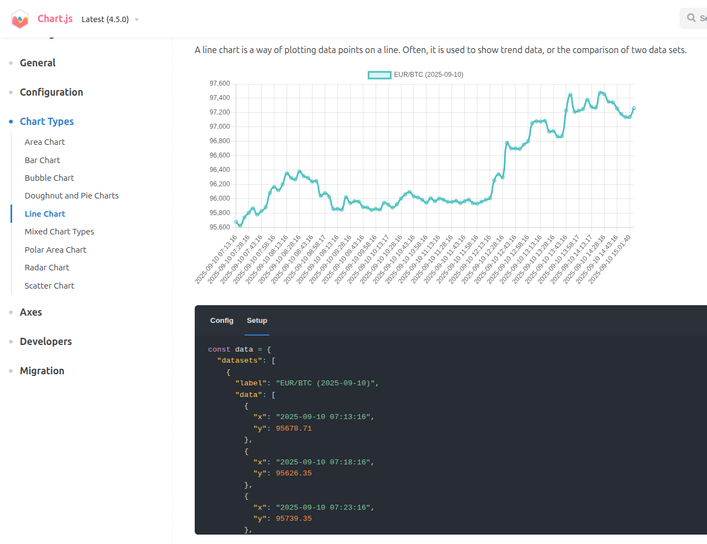

# Cryptocurrency Exchange Rate API

## Tech Stack: PHP 8.4, Symfony 7.3, MySQL 8.3

## Local environment setup
* A [Docker](https://www.docker.com/)-based installer and runtime for the [Symfony](https://symfony.com) web framework,
with [FrankenPHP](https://frankenphp.dev) and [Caddy](https://caddyserver.com/) inside!

1. If not already done, [install Docker Compose](https://docs.docker.com/compose/install/) (v2.10+)
2. Run `docker compose build --pull --no-cache` to build fresh images
3. Run `docker compose up --d` to set up and start a project
4. Open `https://localhost` in your favorite web browser and [accept the auto-generated TLS certificate](https://stackoverflow.com/a/15076602/1352334)
5. Run `docker compose down --remove-orphans` to stop the Docker containers.
6. To check the logs run `docker logs -f <container_name>`

## Setup Docs

1. [Options available](docs/options.md)
2. [Debugging with Xdebug](docs/xdebug.md)
3. [TLS Certificates](docs/tls.md)
4. [Troubleshooting](docs/troubleshooting.md)

## Web API application

 - On the `docker compose up` the application starts **Scheduler** tasks to parse exchange rates every 5 minutes
   (The command is here: [compose.yaml](compose.yaml?L58))

### The app has two endpoints:
1. `https://localhost/api/rates/last-24h?pair=EUR/ETH`
   - Rates for the last 24 hours(every 5 minutes)
2. `https://localhost/api/rates/day?pair=EUR/BTC&date=2025-09-07`
   - Rates for the specified day (every 5 minutes)

### Response data example
```json
{
    "datasets": [
        {
            "label": "EUR/BTC (2025-09-10)",
            "data": [
                {
                    "x": "2025-09-10 07:13:16",
                    "y": 95678.71
                },
                {
                    "x": "2025-09-10 07:18:16",
                    "y": 95626.35
                },
                {
                    "x": "2025-09-10 07:23:16",
                    "y": 95739.35
                },
                {
                    "x": "2025-09-10 07:28:16",
                    "y": 95803.56
                },
            ],
            "borderColor": "rgba(75, 192, 192, 1)",
            "backgroundColor": "rgba(75, 192, 192, 0.2)",
            "tension": 0.1
        }
    ]
}
```

### Response data could be used as a datasets for [chartjs](https://www.chartjs.org/docs/latest/charts/line.html)



## Developers information
 - Connect to the docker container: `docker exec -it <container_name> bash`
### Linters & Static analyzers commands to run inside docker php container:
```
./vendor/bin/php-cs-fixer fix src --diff --dry-run
./vendor/bin/rector process --dry-run src/
./vendor/bin/rector process --dry-run tests/
./vendor/bin/phpstan analyze
```

### Tests:
`./vendor/bin/phpunit`
